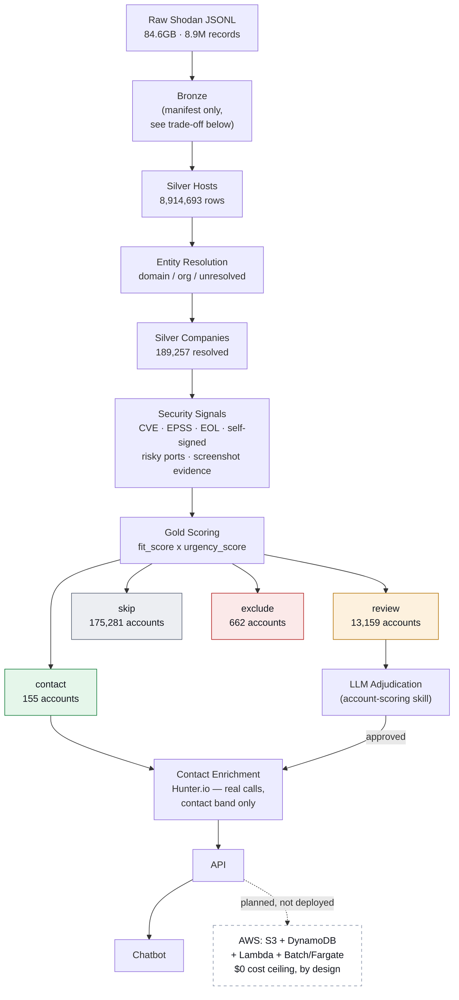
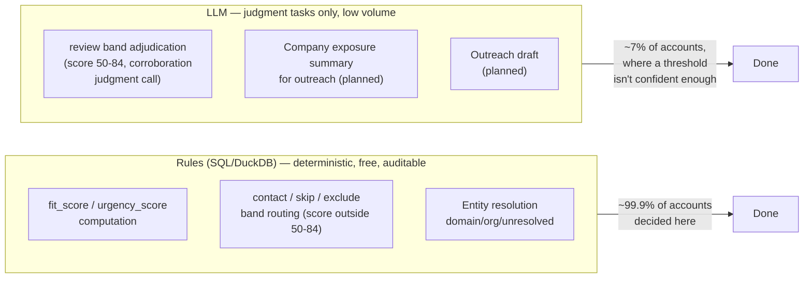
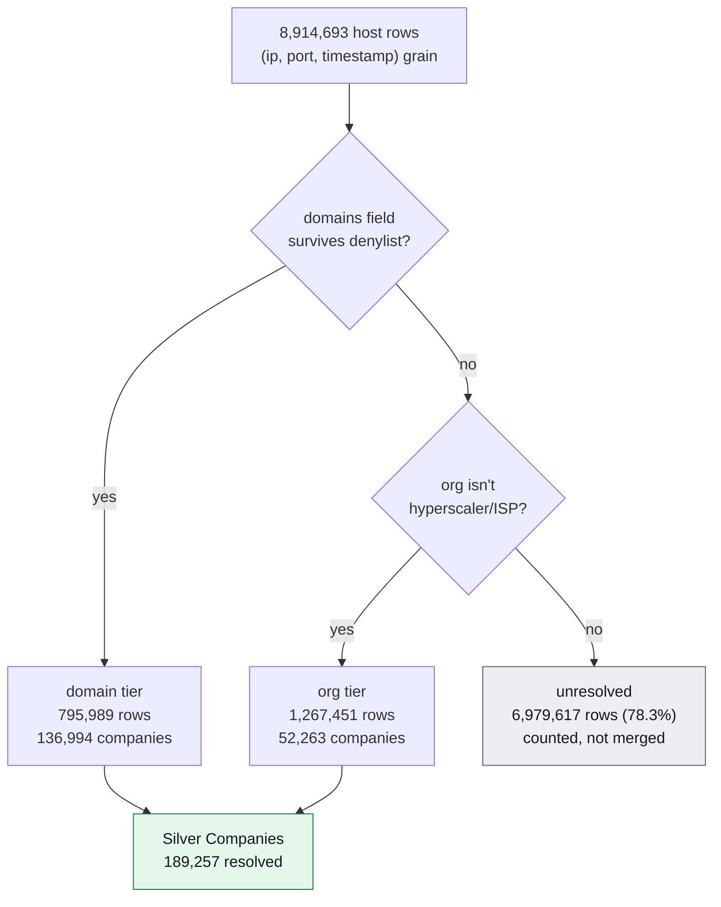
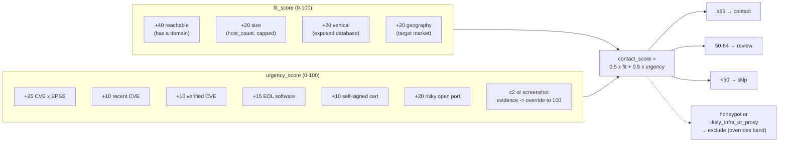

# CyberIntel — AI Sales Intelligence Platform

Turns a raw internet-wide scan export (Shodan-style, 84.6GB, ~8.9M records)
into a ranked, explained account list for a cybersecurity software sales
team: which companies actually need us right now, why, and who to contact.

**Status:** data pipeline + scoring complete and verified against real data
(Sprint 3.5). LLM adjudication skill/prompt/eval built (Sprint 4, in
progress). See [docs/BACKLOG.md](docs/BACKLOG.md) for exact sprint status.

- [Planning doc](docs/PLANNING.md) — the use cases chosen, and why
- [Architecture doc](docs/ARCHITECTURE.md) — design decisions, trade-offs, rule-vs-LLM split, tracing schema
- [Issues & Resolutions](docs/ISSUES_AND_RESOLUTIONS.md) — every data-quality bug found and fixed, with root cause ([presentation version](docs/issues-and-resolutions.html))
- [Backlog](docs/BACKLOG.md) — sprint-by-sprint task tracker

---

## High-level design



Solid boxes are running against real data today. The dashed AWS box is a
documented, containerization-ready target we deliberately didn't deploy —
see [ARCHITECTURE.md's cost trade-offs](docs/ARCHITECTURE.md) for why a $0
ceiling was treated as a hard constraint, not an excuse.

## Rule vs. LLM — where each one is used



Rules decide the clear cases because a salesperson must be able to see
exactly which rows produced a number — an LLM call there would just be an
expensive way to read a number off a threshold. The LLM is reserved for the
one band where the *combination* of signals, not the aggregate score,
determines the right call. Full reasoning in
[ARCHITECTURE.md](docs/ARCHITECTURE.md).

## Entity resolution — how 8.9M host rows become 189K companies



The 78.3% unresolved rate is expected, not a gap to close — it reflects
this dataset's real skew toward hyperscaler/CDN tenant IPs, where the
actual business behind an IP genuinely isn't observable in the scan data.
Precision was chosen over recall throughout; see
[Issues & Resolutions](docs/ISSUES_AND_RESOLUTIONS.md) for the dozen bugs
found while tightening this.

## Scoring model



## Data schema by layer

### Silver Hosts (`data/silver/hosts.parquet`) — 8,914,693 rows, 43.4 bytes/row

One row per exposed service observation. Flattened from the raw JSONL's 60+
top-level fields down to what entity resolution and scoring actually need.

| Column | Type | Notes |
|---|---|---|
| `ip_str`, `port`, `transport`, `ts` | varchar/bigint/timestamp | identity |
| `hostnames`, `domains` | varchar[] | entity resolution backbone |
| `country_code`, `country_name`, `city`, `lat/long` | varchar/double | from `location` |
| `org`, `isp`, `asn` | varchar | ownership (noisy — see denylist trade-offs) |
| `os`, `product`, `devicetype`, `tags`, `cpe23` | varchar/varchar[] | fingerprint |
| `vulns` | `MAP<cve_id, {cvss, epss, verified, ...}>` | CVE exposure |
| `ssl_jarm`, `http_status/server/title` | varchar/bigint | protocol signals |
| `screenshot_labels`, `screenshot_text` | varchar[]/varchar | Shodan-precomputed OCR (rare, ~0.03%, very high signal) |
| `is_eol_product`, `is_self_signed`, `is_honeypot`, `is_c2`, `is_iot`, `is_vpn`, `is_database_tag` | boolean | derived tag flags |

### Silver Companies (`data/silver/companies.parquet`) — 189,257 rows

One row per resolved `(company_key, resolution_tier)`. Key columns:
`company_key`, `resolution_tier` (`domain`/`org`), `host_count`,
`country_count`, `primary_country_code`, `asn_count`, `primary_org`,
`primary_isp`, `sample_ips`, `sample_hostnames`, `likely_infra_or_proxy`.

### Security Signals (`data/gold/security_signals.parquet`) — 189,257 rows

Per-company urgency inputs: `cve_count`, `verified_cve_count`, `max_cvss`,
`max_epss`, `has_recent_cve`, `eol_count`, `self_signed_count`,
`honeypot_count`, `c2_count`, `risky_open_port_count`,
`distinct_port_count`, `database_tag_count`, `has_screenshot_evidence`,
`screenshot_evidence_text`.

### Gold Accounts (`data/gold/accounts.parquet`) — 189,257 rows

Everything above, joined, plus `fit_score`, `urgency_score`,
`contact_score`, `band` (`contact`/`review`/`skip`/`exclude`), and `why[]`
— a human-readable explanation array a salesperson reads directly.

## Repository structure

```
CyberIntel/
├── pipeline/
│   ├── bronze/              # source-file manifest (not a data copy — see ARCHITECTURE.md)
│   ├── silver/               # JSONL -> Silver Hosts (DuckDB)
│   ├── entity_resolution/    # host rows -> companies (denylists + tiering)
│   └── gold/                 # Security Signals + Scoring
├── skills/
│   └── account-scoring/      # SKILL.md — reusable LLM workflow spec
├── prompts/
│   └── account_scoring/      # versioned prompts (v1.md, ...)
├── evals/
│   └── account_scoring/      # labeled_set.jsonl, results, run_eval.py
├── llm/                      # tracing.py — LLM call logging
├── api/                      # (Sprint 5)
├── app/                      # chatbot (Sprint 6)
├── docs/                     # PLANNING, ARCHITECTURE, BACKLOG, ISSUES + HTML companions
└── requirements.txt
```

## Running it locally

```bash
pip install -r requirements.txt

# 1. Decompress the source export (see docs/DATA_SOURCE.md for where to get it)
python scripts/decompress_source.py

# 2. Run the pipeline, in order
python pipeline/bronze/manifest.py
python pipeline/silver/hosts.py             # scans the full 84.6GB, ~90s on NVMe
python pipeline/entity_resolution/resolve.py
python pipeline/gold/security_signals.py
python pipeline/gold/scoring.py

# Sanity check any layer
python pipeline/silver/sanity_check.py
```

Output lands in `data/{bronze,silver,gold}/` (gitignored — regenerated by
the scripts above, not source-controlled).

## Tech stack & why

DuckDB + Parquet for the pipeline (single-node, out-of-core — the right
tool for an 84.6GB one-time transform, not a Spark-cluster-scale problem;
see [ARCHITECTURE.md](docs/ARCHITECTURE.md) for the full reasoning),
Claude for the judgment-only LLM tasks, Hunter.io for contact enrichment,
FastAPI for the API layer. AWS target (S3 + DynamoDB + Lambda) documented
and container-ready but not deployed, by deliberate cost-ceiling choice.
